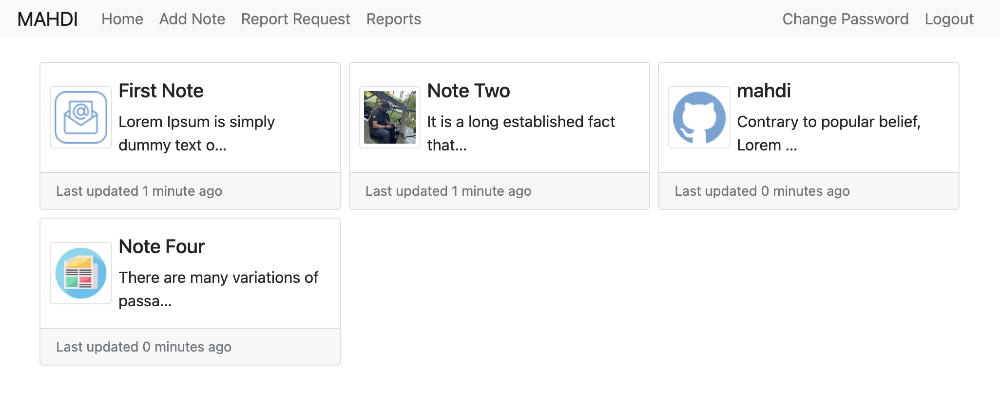
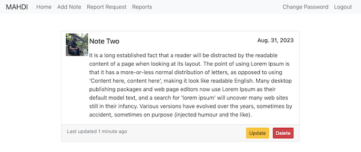
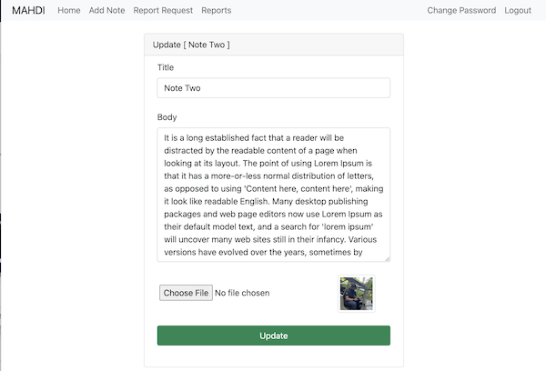
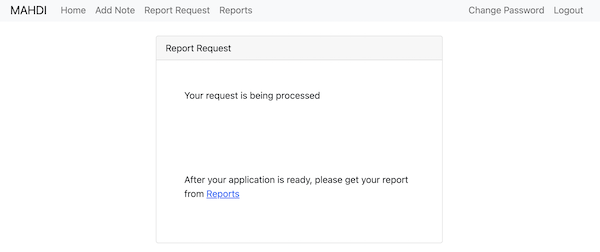
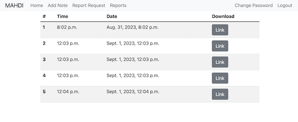
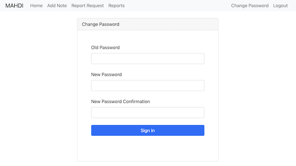
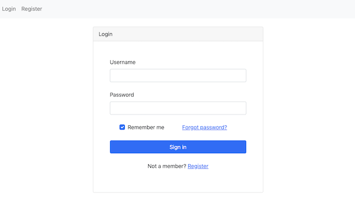
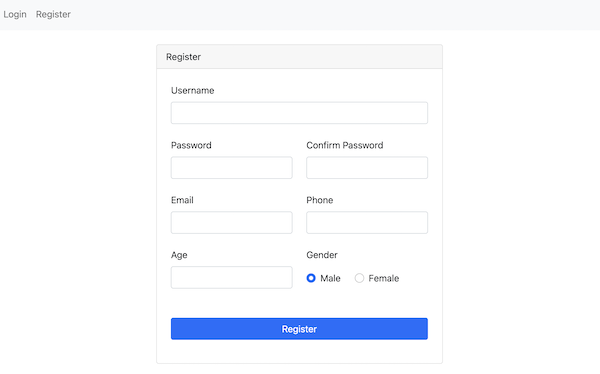

# Django PDF Generator Project


A Django project that allows users to manage their notes, customize their user model, and generate PDF reports of their notes. It also includes user authentication, registration, password management, and utilizes Docker for easy deployment.

## Features

- Customized user model
- User authentication and authorization
- User registration
- Password reset and change functionality
- Note management (CRUD operations)
- PDF report generation for user's notes
- Asynchronous PDF generation with Celery
- Periodic removal of read reports using Celery Beat
- Dockerized for easy deployment
- PostgreSQL database
- Redis for Celery task management
- Bootstrap for styling
- File uploads to a CDN using uploadserver

## Prerequisites

Before you begin, ensure you have met the following requirements:

- Python 3.8+
- Docker and Docker Compose installed
- Redis server installed and running
- Access to a CDN for file uploads

## Installation

1. Clone the repository:

   ```shell
   git clone https://github.com/yourusername/django-notes-project.git
   cd django-notes-project

2. Create a virtual environment and install Python dependencies:

   ```shell
   python -m venv venv
   source venv/bin/activate  # On Windows, use `venv\Scripts\activate`
   pip install -r requirements.txt

3. Set up your environment variables. Create a .env file in the project root and add the following:

   ```shell
   DEBUG=True
   SECRET_KEY=your_secret_key
   CDN_URL=your_cdn_url

4. Build and run Docker containers:

   ```shell
   docker-compose up --build

5. Migrate the database:

   ```shell
   docker-compose exec django python manage.py migrate
   
6. Create a superuser:

   ```shell
   docker-compose exec django python manage.py createsuperuser

7. Access the project at 'http://localhost:8000'.


## Usage

* Register or log in to your account.
* Create, view, update, and delete your notes.
* Generate PDF reports of your notes.
* Manage your account settings.
* Logout when done.


## Project Structure

* **users**: Custom user model and authentication views.
* **notes**: Note and Report models, views, and templates.
* **templates**: HTML templates using Bootstrap for styling.
* **static**: Static files (CSS, JavaScript, images).
* **config**: Project configuration settings.
* **docker-compose.yml**: Docker configuration for containers.
* **Dockerfile**: Docker configuration for the Django app.
* **requirements.txt**: Python dependencies.
* **.env**: Environment variables.

## Celery Tasks

* Asynchronous PDF generation using Celery workers.
* Periodic removal of read reports with Celery Beat.


## Acknowledgments

- [Django](https://www.djangoproject.com/): The high-level Python web framework that powers this project.
- [Celery](https://docs.celeryproject.org/): A distributed task queue used for asynchronous task processing, such as PDF generation.
- [Redis](https://redis.io/): An in-memory data structure store used as a message broker for Celery.
- [Bootstrap](https://getbootstrap.com/): A popular front-end framework for designing responsive and stylish web interfaces.


## Images
### Notes List


### Note Detail


### Update Note


### Send Request to Generate PDF


### Reports List


### Change Password Form


### Login Form


### Register Form


